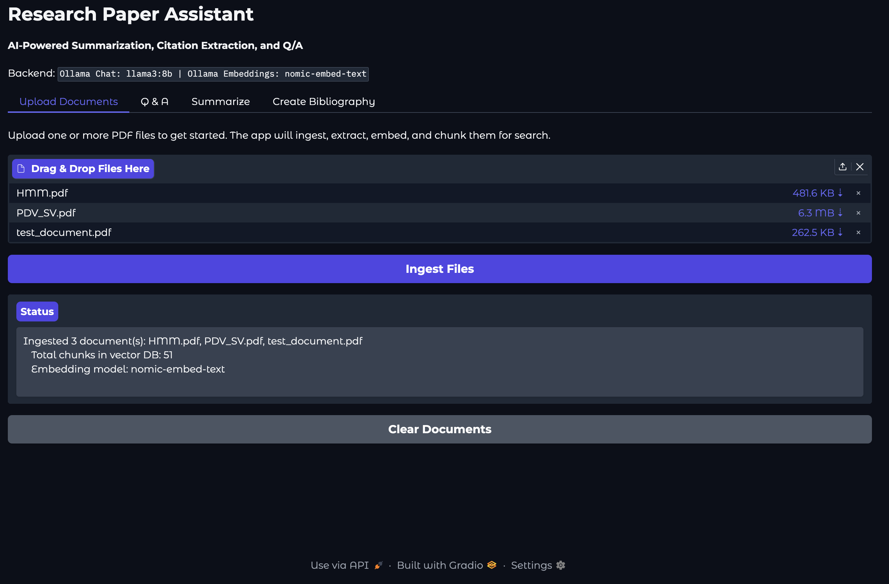
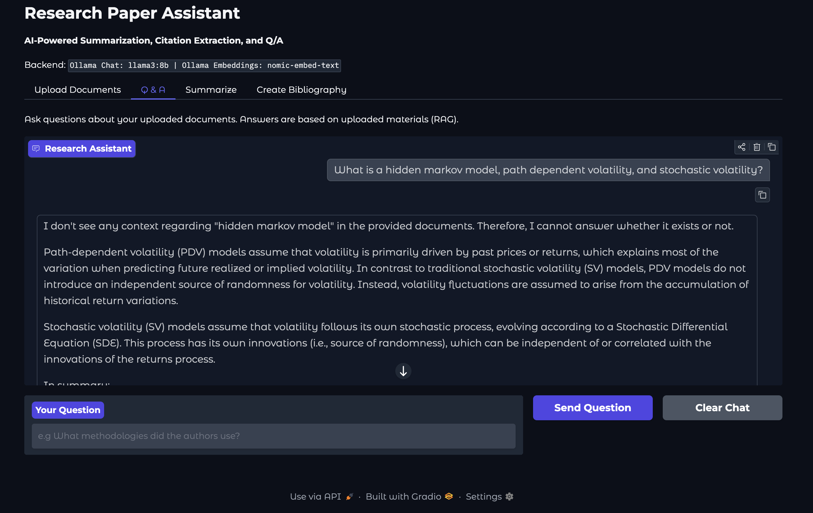
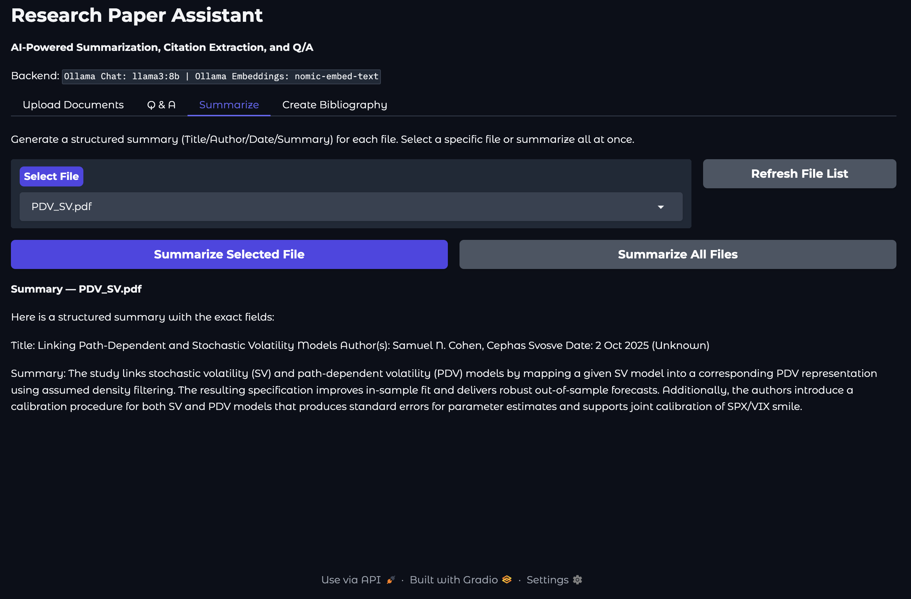
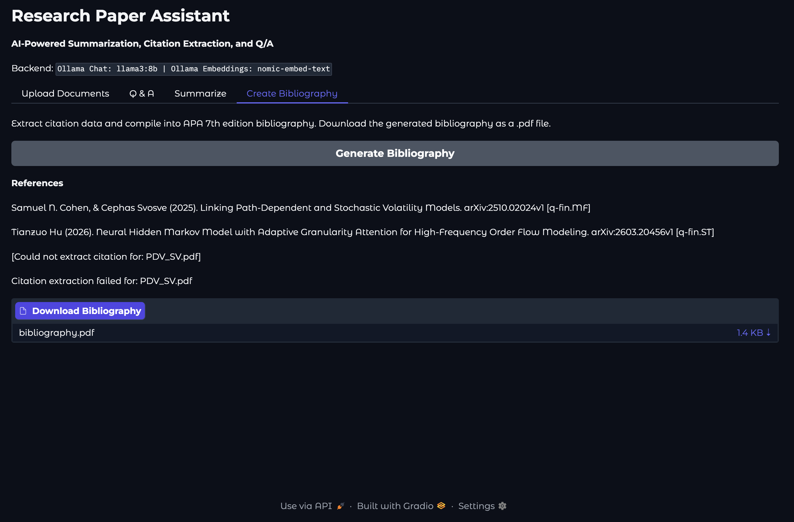

# Research Paper Assistant
### STAT-5350 | Applied Deep Learning
---

<!-- SCREENSHOT: Full app overview — place a screenshot of the running app here -->

## Overview

The Research Paper Assistant is an AI-powered tool designed to make the research process more efficient. Users can upload PDF research articles and interact with them through a clean graphical interface. The app supports document Q&A, structured summarization, and automated APA 7th edition bibliography generation with a downloadable PDF export. All of this is powered by a RAG pipeline running on local open source models via Ollama, with optional support for OpenAI models via a simple configuration change.

---

## Features

- **Document Ingestion** — drag and drop one or more PDF files to extract, chunk, and embed them for search
- **Q&A** — ask questions about your uploaded documents and get context-grounded answers with source citations
- **Summarization** — generate structured summaries (Title, Author, Date, Abstract) for individual documents or all at once
- **Bibliography Generation** — automatically extract citation metadata and compile a formatted APA 7th edition bibliography, exported as a downloadable PDF

---

## Architecture and Technical Approach

The app is built around a Retrieval-Augmented Generation (RAG) pipeline. The core idea is that rather than asking an LLM to answer questions from memory, we first retrieve the most relevant pieces of text from the uploaded documents and then ask the LLM to answer based only on that context. This keeps responses grounded in the actual content of the documents and reduces the risk of the model generating inaccurate information.

The pipeline works as follows:

```
PDF Upload
    |
    v
Text Extraction (pypdf)
    |
    v
Chunking (500-word chunks, 100-word overlap)
    |
    v
Embedding (nomic-embed-text via Ollama)
    |
    v
In-Memory Vector Database
    |
    |-- Q&A Query --> Embed query --> Cosine Similarity Search --> Top-K Chunks --> LLM --> Answer
    |
    |-- Summarize --> First 1000 words --> LLM --> Structured Summary
    |
    └-- Bibliography --> First 500 words --> LLM (JSON) --> APA Format --> PDF Export
```

The vector database is kept in memory intentionally to keep the prototype simple and dependency-free. Embeddings are generated at ingestion time so that Q&A and summarization requests are fast at query time.

---

## Module Descriptions

The application is split into six modules to keep the codebase readable and maintainable.

**`config.py`** loads all environment variables from the `.env` file and exposes them as constants. Every other module pulls its configuration from here rather than reading environment variables directly.

**`llm.py`** initializes the LLM and embedding clients based on the active configuration (Ollama or OpenAI) and exposes two simple functions, `embed()` and `llm_chat()`, that the rest of the app calls without needing to know which backend is active.

**`utils.py`** contains pure utility functions with no app state. This includes text chunking, cosine similarity calculation, PDF text extraction, APA citation formatting, and bibliography PDF generation.

**`rag.py`** owns the in-memory vector database and manages the full RAG pipeline. It handles document ingestion, chunk embedding, semantic search, and state resets.

**`features.py`** implements the three core user-facing features: document Q&A, summarization, and bibliography generation. It coordinates between `rag.py` for retrieval and `llm.py` for generation.

**`Research_Assistant_App.py`** defines the Gradio web interface and wires all user interactions to the underlying modules. This file contains only UI layout and event handling.

---

## Requirements

**Python**
- Python 3.11 or higher

**Ollama** (for local model inference)
- Install from https://ollama.com
- Required models:
```bash
ollama pull nomic-embed-text
ollama pull llama3:8b
```

**Python Packages**
```
gradio>=6.0.0
openai>=1.0.0
pypdf>=4.0.0
fpdf2>=2.7.0
python-dotenv>=1.0.0
```

**Docker** (optional, for containerized deployment)
- Install Docker Desktop from https://www.docker.com/products/docker-desktop
- Use the Apple Silicon version for M1/M2/M3/M4 Macs, Intel version for all others

---

## Configuration

All configuration is handled via the `.env` file in the project directory. The following variables are available:

| Variable | Default | Description |
|---|---|---|
| `OLLAMA_BASE_URL` | `http://localhost:11434/v1` | Ollama server URL |
| `EMBEDDING_MODEL` | `nomic-embed-text` | Ollama embedding model |
| `CHAT_MODEL` | `llama3:8b` | Ollama chat model |
| `USE_OPENAI` | `false` | Set to `true` to use OpenAI instead of Ollama |
| `OPENAI_API_KEY` | — | Your OpenAI API key |
| `OPENAI_EMBED_MODEL` | `text-embedding-3-small` | OpenAI embedding model |
| `OPENAI_CHAT_MODEL` | `gpt-4o-mini` | OpenAI chat model |
| `TOP_K` | `5` | Number of chunks retrieved per query |

To switch to OpenAI, set `USE_OPENAI=true` and provide your `OPENAI_API_KEY` in the `.env` file.

---

## Local Installation and Setup

**1. Clone the repository**
```bash
git clone https://github.com/magnuswmiller/STAT-5350.git
cd STAT-5350/STAT-5350-ResearchAssistant
```

**2. Create and activate a virtual environment**
```bash
python3 -m venv .venv
source .venv/bin/activate
```

**3. Install dependencies**
```bash
pip install -r requirements.txt
```

**4. Configure your environment**

Copy or edit the `.env` file and set your preferred models. The defaults will work out of the box with Ollama.

**5. Pull the required Ollama models**
```bash
ollama pull nomic-embed-text
ollama pull llama3:8b
```

**6. Start Ollama**

If Ollama is not already running, start it in a separate terminal:
```bash
ollama serve
```

**7. Run the app**
```bash
python3 Research_Assistant_App.py
```

Open http://localhost:7860 in your browser.

---

## Docker Deployment

**1. Make sure Docker Desktop is running**

Open Docker Desktop and wait for the whale icon in the menu bar to stop animating before proceeding.

**2. Build the image**
```bash
cd STAT-5350/STAT-5350-ResearchAssistant
docker build -t research-assistant .
```

**3. Run the container**
```bash
docker run -p 7860:7860 \
  -e OLLAMA_BASE_URL=http://host.docker.internal:11434/v1 \
  research-assistant
```

The `-e OLLAMA_BASE_URL=http://host.docker.internal:11434/v1` flag is important. It tells the container to route Ollama requests back to your host machine since Ollama is not running inside the container. Without this, the app would look for Ollama at `localhost` inside the container and fail to connect.

**4. Open the app**

Navigate to http://localhost:7860 in your browser. The app will behave identically to the local version.

---

## Usage Guide


**Upload Documents**

Drag and drop one or more PDF files into the upload box and click Ingest Files. The app will extract the text, split it into chunks, and embed each chunk. The status box will confirm how many documents were ingested and how many chunks are in the vector database. Note that large documents may take a moment to embed.


**Q&A**

Navigate to the Q&A tab and type your question into the input box. Click Send Question or press Enter. The app will retrieve the most relevant chunks from your documents and generate a grounded answer with source filenames cited. If no documents have been ingested, the app will prompt you to upload some first.


**Summarize**

Click Refresh File List to populate the dropdown with your ingested documents. Select a file and click Summarize Selected File for a single summary, or click Summarize All Files to generate summaries for everything in the vector database. Each summary includes the document title, author(s), date, and a short abstract-style paragraph.


**Create Bibliography**

Click Generate Bibliography to extract citation metadata from all ingested documents and compile them into an alphabetically sorted APA 7th edition reference list. The formatted citations will appear in the app and a downloadable PDF will be available below the output.

---
*NOTE: This README was generated using Claude based on provided code, design documents, and the final write-up*
